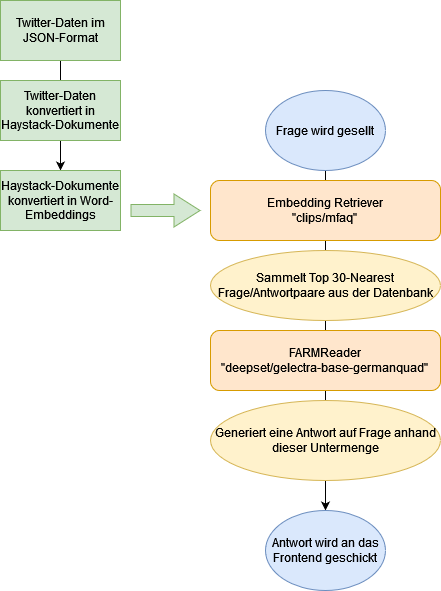

# Konzept
“Ask DB Anything” ist ein Chatbot basierend auf Tweets der Deutschen Bahn. Ein Machine-Learning-Modell wurde mit diesen Tweets trainiert. Über eine Weboberfläche lassen sich Fragen stellen, für die das Modell eine möglichst passende Antwort finden soll.

# Nutzung
Um den Code zu testen, bietet sich die **"DataChallenges_Presentation.ipynb"** an. Das ist unsere am besten funktionierende Pipeline. Um unsere Arbeitsschritte nachvollziehen zu können, gibt es noch alternativ **"DataChallenges.ipynb"**, welche redundanten Code hat und nur zur Veranschaulichung dient.

# Daten
Unter @DB_Bahn findet sich ein Archiv von rund 600.000 Tweets, darunter viele Hilfestellungen, Kundenbeschwerden und Verbesserungswünsche. Mit der Twitter-Scraping-Bibliothek Twint haben wir einen Datensatz von etwa 70.000 Tweets aus den letzten sechs Monaten heruntergeladen.
Der Informationsgehalt der Tweets ist sehr unterschiedlich - von hilfreich und realitätsnah bis ironisch und banal.

# Implementierung
Für die Arbeitsoberfläche haben wir uns für Google Colab entschieden, dank der einfachen Möglichkeit der Zusammenarbeit. Um die Daten für unsere Pipeline vorzubereiten, haben wir die Frage-Antwort-Paare von Twitter in Word-Embeddings umgewandelt. Für die Implementierung konnten wir uns die einzelnen Elemente, die von Haystack bereitgestellt werden, zu Nutze machen. Die Pipeline besteht aus einem Embedding Retriever (“clips/mfaq”), der aus einer Menge von über 70.000 Word-Embeddings die 30 nächstgelegenen Nachbarn in Bezug auf die vom Benutzer gestellte Frage sammelt. Auf diese Teilmenge wird ein FARMReader angewendet, der ein deutsches BERT-Modell (“deepset/gelectra-base-germanquad”) enthält, das auf Question-Answering trainiert wurde. Somit wird von dieser Untermenge an Frage-Antwort-Paaren eine Antwort generiert, die die Frage des Benutzers beantwortet. Diese Antwort wird dann an das Frontend weitergeleitet und somit ausgegeben. Die Modelle für den Retriever und den Reader haben wir aus Huggingface's Bibliothek für vortrainierte Machine-Learning Modelle übernommen.

# Weboberfläche
Die Benutzeroberfläche wurde mit Jupyter Widgets umgesetzt. Damit lassen sich Frontend und Backend im selben Jupyter Notebook entwickeln und testen. Das hilft bei schnellen Anpassungen und einer besseren Reproduzierbarkeit.

# Auswertung
Die Bahn arbeitet bereits an einem offiziellen Chatbot mit dem Namen DB Smile.
Im direkten Vergleich weiß DB Smile auf einige Fragen keine passende Antwort. Dafür sind die Antworten von unserem Chatbot signifikant häufiger unpassend oder sogar falsch.
